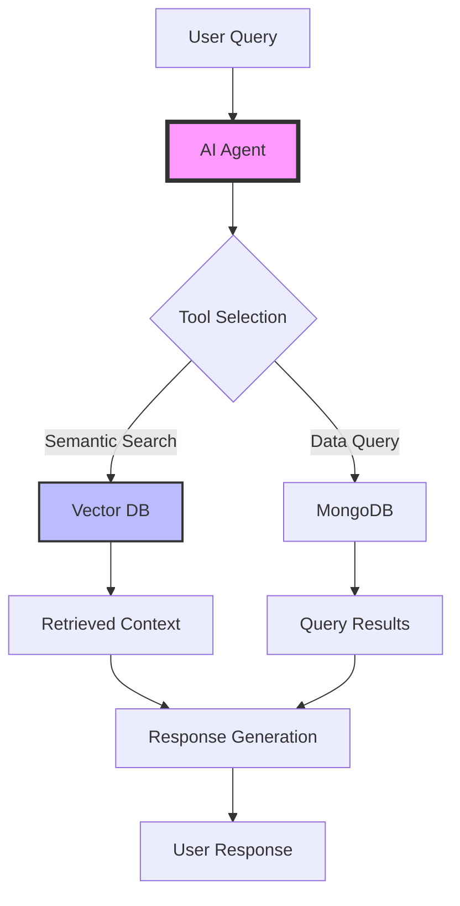

# Multimodal Agents Lab: Comprehensive Guide & Enhancement Proposal

## 🎯 Lab Overview

This hands-on lab teaches developers how to build sophisticated AI agents that can process multiple data modalities (text and images) using MongoDB Atlas, Google Gemini, and VoyageAI. The lab progresses from basic PDF processing to implementing a full ReAct (Reasoning + Acting) agent with conversational memory.

## 📚 Current Structure

### Learning Path
The lab consists of 12 main steps with 19 CODE_BLOCK exercises:

1. **Environment Setup** → MongoDB connection and API keys
2. **PDF Processing** → Extract research paper as images (CODE_BLOCKS 1-2)
3. **Data Storage** → Store in MongoDB (CODE_BLOCK 3)
4. **Vector Search Setup** → Create search index (CODE_BLOCK 4)
5. **Similarity Search** → Build search pipeline (CODE_BLOCKS 5-6)
6. **Agent Tools** → Define callable functions (CODE_BLOCKS 7-9)
7. **LLM Integration** → Configure Gemini (CODE_BLOCK 10)
8. **Tool Execution** → Implement tool calling (CODE_BLOCKS 11-12)
9. **Memory System** → Add conversation history (CODE_BLOCKS 13-15)
10. **Memory Integration** → Enhance agent with memory (CODE_BLOCKS 16-19)
11. **ReAct Pattern** → Advanced reasoning agent
12. **Testing** → Validate the complete system

### How It Works
- Students open `lab.ipynb` which contains explanatory text and `<CODE_BLOCK_X>` placeholders
- They reference `solutions.ipynb` to find the corresponding code
- Each CODE_BLOCK builds upon previous ones, creating a complete system

## 🚀 Enhancement Proposals

### 1. **Interactive Visual Learning**

#### A. Concept Visualizers
```python
# Add after Step 3: Visualize the embedding process
def visualize_embedding_space(embeddings, labels):
    """Interactive 3D plot of embedding space using plotly"""
    # Reduce dimensions with t-SNE
    # Create interactive scatter plot
    # Show clusters of similar content
    
# Add after Step 5: Show vector search in action
def animate_vector_search(query_embedding, document_embeddings):
    """Animated visualization of cosine similarity calculation"""
    # Show query vector
    # Animate similarity calculations
    # Highlight top results
```

#### B. Architecture Diagrams
Create interactive Mermaid diagrams that students can explore:



### 2. **Progressive Validation System**

#### A. Auto-Grading Functions
```python
def validate_code_block(block_number, student_code):
    """
    Validates student implementation against expected behavior
    Returns: (success, feedback_message, hints)
    """
    validators = {
        1: validate_pdf_processing,
        2: validate_image_extraction,
        3: validate_mongodb_insertion,
        # ... etc
    }
    return validators[block_number](student_code)

# Example validator
def validate_vector_search(pipeline):
    """Validates CODE_BLOCK_5 implementation"""
    checks = [
        ("Has $vectorSearch stage", "$vectorSearch" in str(pipeline)),
        ("Correct index name", "vector_index" in str(pipeline)),
        ("Has limit parameter", "limit" in str(pipeline)),
        ("Returns score", "score" in str(pipeline))
    ]
    
    passed = all(check[1] for check in checks)
    feedback = generate_feedback(checks)
    hints = generate_hints(checks) if not passed else []
    
    return passed, feedback, hints
```

#### B. Interactive Testing Cells
After each CODE_BLOCK, add a test cell:

```python
# 🧪 Test Your Implementation
test_result = validate_code_block(5, your_pipeline)
display_test_results(test_result)

if test_result.success:
    print("✅ Great job! Your implementation is correct!")
    show_bonus_challenge()
else:
    print("❌ Not quite right. Here are some hints:")
    for hint in test_result.hints:
        print(f"  💡 {hint}")
```

### 3. **Enhanced Learning Experience**

#### A. Difficulty Modes
```python
class LabMode(Enum):
    BEGINNER = "beginner"      # More hints, smaller steps
    STANDARD = "standard"      # Current difficulty
    ADVANCED = "advanced"      # Additional challenges
    EXPERT = "expert"          # Build extensions

# At lab start:
mode = select_difficulty_mode()
lab_content = load_content_for_mode(mode)
```

#### B. Interactive Debugging Tools
```python
class AgentDebugger:
    """Visual debugger for agent interactions"""
    
    def trace_reasoning(self, agent_response):
        """Shows step-by-step agent reasoning"""
        # Parse agent thoughts
        # Visualize decision tree
        # Highlight tool calls
        
    def compare_modes(self, query):
        """Side-by-side comparison of agent with/without memory"""
        # Run query on both agents
        # Show differences in responses
        # Highlight memory impact
```

### 4. **Gamification Elements**

#### A. Achievement System
```python
achievements = {
    "first_vector": "Created your first vector embedding! 🎉",
    "search_master": "Successfully implemented vector search! 🔍",
    "tool_caller": "Your agent can now use tools! 🛠️",
    "memory_keeper": "Added memory to your agent! 🧠",
    "react_expert": "Mastered the ReAct pattern! 🎓"
}

def check_achievements(completed_blocks):
    """Awards achievements based on progress"""
    # Check completion criteria
    # Display achievement notifications
    # Update progress dashboard
```

#### B. Progress Dashboard
```python
def display_progress_dashboard():
    """Shows visual progress through the lab"""
    # Progress bar for overall completion
    # Skill tree showing unlocked capabilities
    # Time estimates for remaining sections
    # Leaderboard for workshop settings
```

### 5. **Real-World Context**

#### A. Use Case Scenarios
Add cells that demonstrate real applications:

```python
# 💼 Real-World Scenario: Customer Support Bot
# Your agent can now help customers by:
# 1. Understanding their question (text or screenshot)
# 2. Searching relevant documentation
# 3. Providing contextual answers
# 4. Remembering conversation history

# Try it out:
customer_query = "My application is showing error 404"
response = agent.help_customer(customer_query)
visualize_support_interaction(response)
```

#### B. Industry Examples
```python
# 🏭 Industry Applications
applications = {
    "Healthcare": "Analyzing medical images with clinical notes",
    "E-commerce": "Visual product search with text refinement",
    "Education": "Multimodal tutoring systems",
    "Security": "Document and image analysis for compliance"
}

for industry, use_case in applications.items():
    show_example_implementation(industry, use_case)
```

### 6. **Enhanced Error Handling**

#### A. Common Pitfalls Guide
```python
class CommonErrors:
    """Interactive error resolution guide"""
    
    ERRORS = {
        "connection_failed": {
            "symptoms": ["MongoClient error", "Connection timeout"],
            "solutions": [
                "Check your MONGO_URI format",
                "Verify network connectivity",
                "Ensure IP is whitelisted"
            ],
            "test_fix": lambda: test_mongodb_connection()
        },
        "embedding_mismatch": {
            "symptoms": ["Dimension mismatch", "Vector search fails"],
            "solutions": [
                "Ensure all embeddings use same model",
                "Check embedding dimension (1024)",
                "Verify index configuration"
            ],
            "test_fix": lambda: validate_embeddings()
        }
    }
    
    def diagnose_and_fix(self, error_message):
        """Automatically suggests fixes for common errors"""
        # Match error pattern
        # Provide targeted solutions
        # Offer to run diagnostic tests
```

### 7. **Interactive Agent Playground**

#### A. Experiment Sandbox
```python
# 🎮 Agent Playground
class AgentPlayground:
    """Interactive environment for testing agent capabilities"""
    
    def __init__(self, agent):
        self.agent = agent
        self.metrics = MetricsCollector()
        
    def interactive_chat(self):
        """Chat interface with real-time metrics"""
        # Display chat UI
        # Show reasoning process
        # Track performance metrics
        
    def a_b_test(self, prompts):
        """Compare different prompt strategies"""
        # Run multiple prompts
        # Visualize differences
        # Suggest optimizations
        
    def stress_test(self):
        """Test agent limits and edge cases"""
        # Generate challenging queries
        # Measure response quality
        # Identify improvement areas
```

### 8. **Collaborative Features**

#### A. Peer Learning
```python
# 👥 Collaborative Learning
class WorkshopCollaboration:
    """Enable peer learning in workshop settings"""
    
    def share_solution(self, code_block_num, solution):
        """Share anonymous solutions for discussion"""
        # Anonymize code
        # Display for group review
        # Facilitate discussion
        
    def vote_best_approach(self, solutions):
        """Democratic selection of best solutions"""
        # Display options
        # Collect votes
        # Discuss trade-offs
```

## 📝 Implementation Roadmap

### Phase 1: Foundation (Week 1-2)
- [ ] Add validation functions for all CODE_BLOCKs
- [ ] Create progress tracking system
- [ ] Implement basic visualizations

### Phase 2: Interactivity (Week 3-4)
- [ ] Build interactive debugging tools
- [ ] Add experiment sandbox
- [ ] Create achievement system

### Phase 3: Polish (Week 5-6)
- [ ] Add comprehensive error handling
- [ ] Implement difficulty modes
- [ ] Create collaborative features

### Phase 4: Testing (Week 7-8)
- [ ] Run pilot workshops
- [ ] Gather feedback
- [ ] Iterate on improvements

## 🎯 Success Metrics

1. **Completion Rate**: Track % of students completing all CODE_BLOCKs
2. **Time to Complete**: Measure average completion time per section
3. **Error Frequency**: Monitor common stumbling blocks
4. **Engagement Score**: Track use of interactive features
5. **Learning Outcomes**: Assess understanding through challenges

## 💡 Quick Wins

Immediate improvements that can be implemented quickly:

1. **Add a "Check Your Work" cell after each CODE_BLOCK**
2. **Include visual diagrams for complex concepts**
3. **Create a troubleshooting guide as a separate notebook**
4. **Add "What You'll Build" preview at the start**
5. **Include celebration messages for milestones**

## 🚀 Next Steps

1. **Prioritize** which enhancements to implement first
2. **Create** a development branch for improvements
3. **Test** with a small group of developers
4. **Iterate** based on feedback
5. **Deploy** enhanced version for next workshop

This enhanced lab will transform the learning experience from a simple fill-in-the-blanks exercise to an engaging, interactive journey that builds real understanding and excitement about multimodal AI agents.