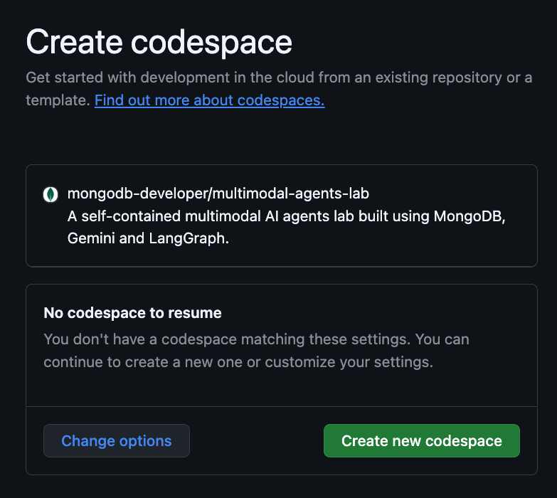
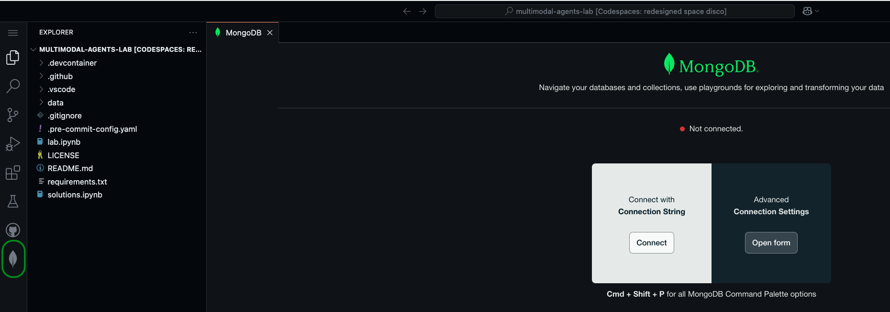
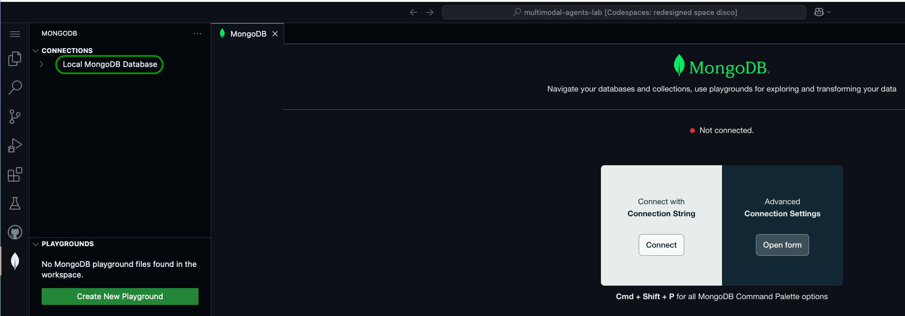
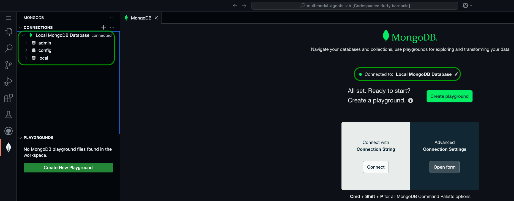
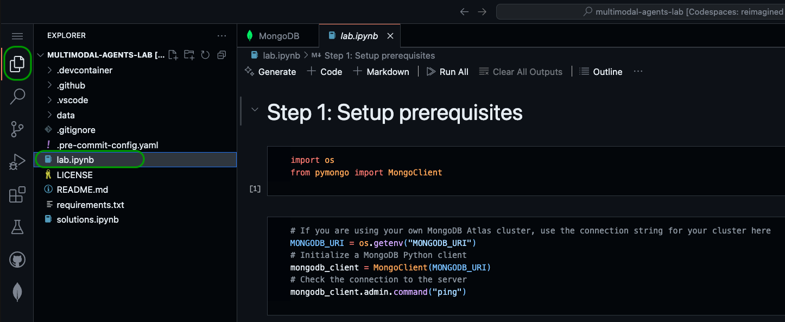
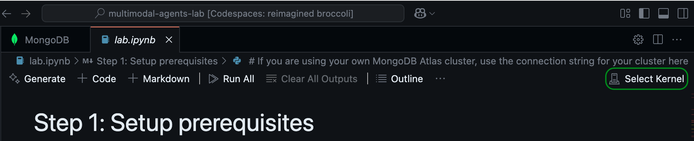
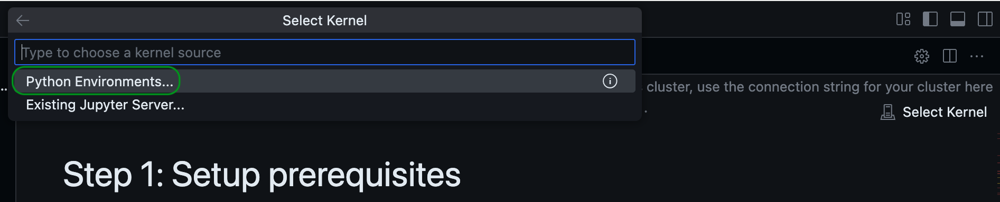
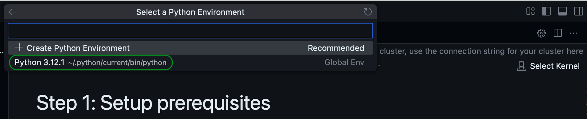

# multimodal-agents-lab
A self-contained multimodal AI agents lab built using MongoDB, Gemini, and good ol' Python.

Slides accompanying this lab can be found [here](https://docs.google.com/presentation/d/e/2PACX-1vR3YoEwBOHTj3ai90BiDohGbusGwg-IB16A20vtBTq3Bg5wcdhFSYYgVmhza9aXYOhkAkTiQySR8AuC/pub).

**NOTE:** In this lab, we will be using Jupyter Notebooks, which is an interactive Python environment. If you are new to Jupyter Notebooks, use [this](https://mongodb-developer.github.io/vector-search-lab/docs/dev-env/jupyter-notebooks) guide to familiarize yourself with the environment.

# Running the lab

The easiest way to run this lab is GitHub Codespaces. A codespace is a cloud-hosted, containerized development environment that comes pre-configured with all the tools you need to run this lab.

To create a codespace, navigate to [this](https://github.com/codespaces/new/mongodb-developer/multimodal-agents-lab?quickstart=1) link. You will be prompted to sign into GitHub if you haven't already. Once signed in, click the Create new codespace button to create a new codespace.

Let it run for a few seconds as it prepares a Docker container with all the required libraries and a MongoDB cluster.

## Connect to the MongoDB cluster

Once the environment is built, you will be prompted to connect to the MongoDB cluster via MongoDB's VSCode extension. This will allow you to visualize the data that we will import into the cluster later in the lab, directly from the VSCode IDE.

To connect to the cluster, click the leaf icon in the left navigation bar of the IDE.

Under Connections, click the "Local MongoDB Database" connection. This should automatically establish a connection to the local MongoDB cluster.

If the connection was successful, you should see **Connected to: Local MongoDB Database** with a green indicator. You will also see the default databases in the cluster appear under Connections. Any additional databases we create during the lab will also appear here.

## Jupyter Notebook setup

You will be filling code in a Jupyter Notebook during this lab, so let's get set up with that next!

Within the codespace, click on the files icon in the left navigation bar of the IDE. In the Explorer menu, click on the file named `lab.ipynb` to open the Jupyter Notebook for this lab.

Next, select the Python interpreter by clicking **Select Kernel** at the top right of the IDE.

In the modal that appears, click **Python environments...** and select the interpreter that is marked as **Recommended** or **Global Env**.

That's it! You're ready for the lab!
